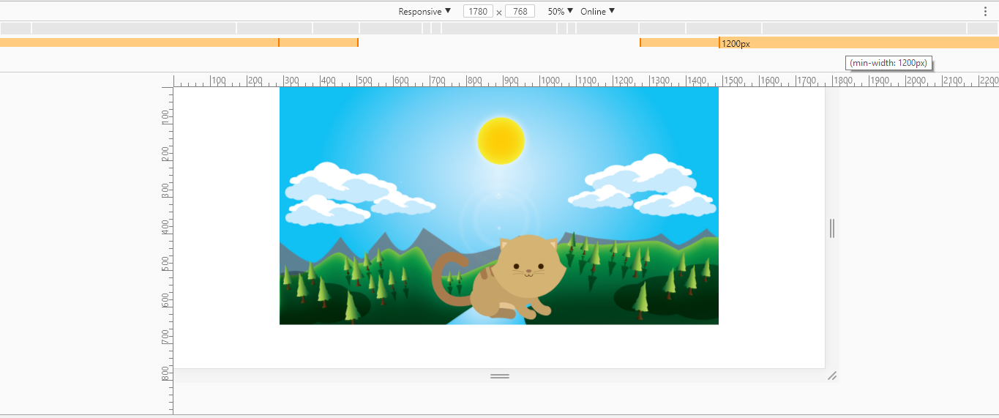
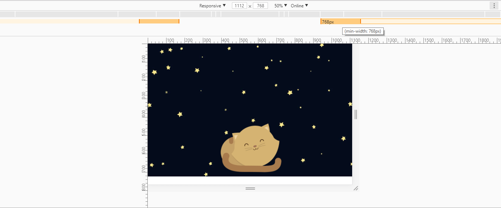
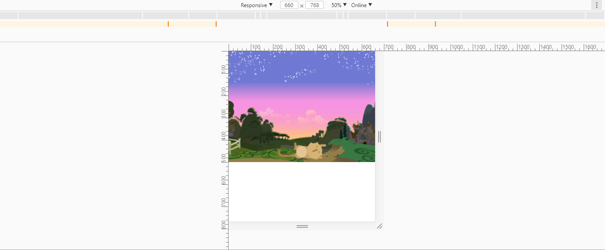

# **Reto: Kittens** <h1>
***
## Sobre el proyecto <h2>

Crea una página web donde se muestre un paisaje y un gatito diferente a medida que la ventana del navegador se haga más pequeña.

## Flujo de trabajo <h2>

En este reto se nos pidió realizar una _web responsive_ que al cambiar de _desktop_ a _tablet_ y de ésta a _mobile_  fuera cambiando el escenario y los gatitos. (imágenes previamente dadas).

Como resultado se obtuvo lo siguiente:

**Vista Desktop**

**Vista Tablet**

**Vista Mobile**

